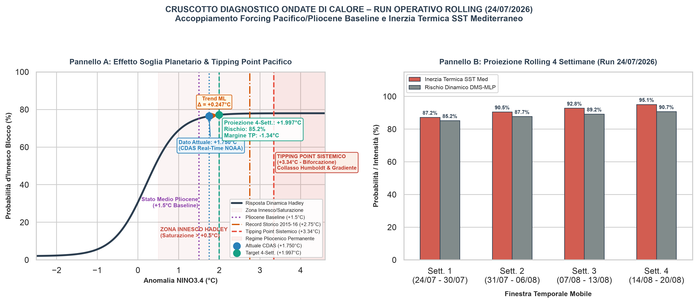

# Enso-TippingPoint-Heatwave-Lab

> **ML Pipeline & Physics-Informed Local LLM Agent for Mediterranean Heatwave Forecasting and ENSO Tipping Point Dynamics**

[](https://www.python.org/)
[](https://opensource.org/licenses/MIT)
[](https://ollama.ai/)

---

## 📌 Executive Summary

**Enso-TippingPoint-Heatwave-Lab** is an integrated climate diagnostics framework that links Pacific SST anomalies (NINO3.4) with tropical atmospheric circulation and Mediterranean extreme events. 

By combining a deterministic Machine Learning predictive engine (`Scikit-Learn`) with a physics-constrained local semantic agent (`Ollama / Llama 3.2`), the system generates 4-week rolling forecasts of:
1. **NINO3.4 Sea Surface Temperature (SST) Anomalies** and distance to the critical Pacific tipping point.
2. **Hadley Cell Saturation & Atmospheric Subsidence**, driving persistent Subtropical High blocking.
3. **Mediterranean Heatwave (MHW) & Heat Dome Risks**, evaluated on a weekly resolution.
4. **Automated Operational Criticality Levels** (`CRITICITÀ ARANCIONE / ELEVATA`).

---

## 📊 Forecast & Diagnostic Outputs

Below is the latest generated diagnostic visualization and rolling forecast overview:



*The plot displays the NINO3.4 SST anomaly trajectory alongside the Hadley Cell saturation probability and the distance to the +3.34 °C Permanent El Niño tipping threshold.*

---

## 🔬 Scientific & Geophysical Foundations

### 1. The ENSO Tipping Point (+3.34 °C)
* **Fold Bifurcation Physics:** The critical threshold ($+3.34\text{ }^\circ\text{C}$) represents the collapse of the equatorial Pacific West-East thermal gradient and the breakdown of the **Bjerknes Feedback**.
* **Permanent El Niño Risk:** Crossing this threshold halts Humboldt Current upwelling, driving a transition from the oscillatory Holocene regime to a permanent Pliocene-like state.
* **Safety Margin Monitoring:** The system continuously evaluates the safety margin (e.g., $-1.34\text{ }^\circ\text{C}$ relative to target anomalies) to guarantee model stability.

### 2. Hadley Cell & Mediterranean Heat Dome Dynamics
* **Atmospheric Subsidence:** Tropical SST warming drives Hadley Cell expansion and meridional saturation ($>85\%$).
* **Heatwave Teleconnection:** Enhanced subsidence over the Mediterranean basin creates stagnant adiabatic warming, consolidating **Heat Dome** structures and increasing weekly heatwave probabilities.

---

## 🛠️ Architecture & Workflow

1. **`main.py` / `src/ml_engine.py`**:
   - Fetches CDAS real-time SST data and processes rolling 4-week NINO3.4 projections.
   - Computes probability matrices for Hadley Cell saturation and weekly heatwave risk.
2. **`src/ollama_agent.py`**:
   - Consumes quantitative metrics via evaluation-branching rules (temperature $0.10$).
   - Enforces strict anti-hallucination constraints on geophysical terminology.
   - Generates a fully bilingual diagnostic report saved to `outputs/report_rolling_4_settimane.md`.

---

## 🚀 Quick Start & Installation

### Prerequisites
* Python 3.10+
* [Ollama](https://ollama.ai/) installed and running locally with `llama3.2:3b`.

```bash
# 1. Clone the repository
git clone [https://github.com/enrico-gpe/Enso-TippingPoint-Heatwave-Lab.git](https://github.com/enrico-gpe/Enso-TippingPoint-Heatwave-Lab.git)
cd Enso-TippingPoint-Heatwave-Lab

# 2. Create and activate a virtual environment
python3 -m venv venv
source venv/bin/activate

# 3. Install dependencies
pip install -r requirements.txt

# 4. Ensure Ollama is serving the model
ollama pull llama3.2:3b
ollama serve
```

## 💻 Running the Pipeline

Execute the main orchestrator script to run the ML forecast and generate the bilingual report:

```bash
python main.py

```
The output report and generated plots are saved to:

outputs/
- heatwave_diagnostic_rolling.png
- report_rolling_4_settimane.md

## License


This project is licensed under the **GNU General Public License v3.0** (GPLv3).
Copyright (C) 2026 Enrico Pozzi
Questo programma è software libero: puoi ridistribuirlo e/o modificarlo secondo i termini della GNU General Public License come pubblicata dalla Free Software Foundation, o la versione 3 della licenza, o (a tua scelta) una versione successiva.

Vedi il file [LICENSE](LICENSE) per il testo completo della licenza
